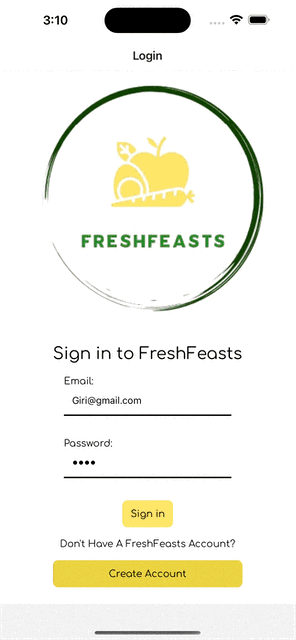

# FreshFeast App
**FreshFeast is a full-stack React-Native-powered mobile app built with six essential features of a competitive mobile food delivery service app.**

# Building The FreshFeast App
The following libraries and frameworks are installed to build the fully functioning and stylistic mobile app:

### Language/Library

### Environment

### Bundler Pack

# Navigating Screens
Through the app, users are able to access and use the following features:
* Login/Register
* Profile
* Main Menu
* Calendar
* Chat
* Checkout Cart

## Login/Register Screen Demo:

The login feature ensures users will have their own FreshFeasts experience from the creation of the account. The app asks the user for basic personal information, diet preferences, and allergens. Upon logging in, curated meals will be personalized for each user's choice.

## Profile Screen Demo:

The Profile feature allows users to change the personal information they input during the sign-in process, including their name, email, and delivery address. In addition, there is a toggle button for dark mode and an order history page.

## Main Menu Screen Demo:

The Main Menu feature ensures users can view and pick all of the available meals. On top, there is an auto-rotating carousel of the chef's recommendations. Below, there is a full list of the meals with sorting and filtering options. Users clicking on items in the carousel or list will open a details modal that shows the description, ingredients, nutritional information, reviews, and allows users to add items to the cart.

## Calendar Screen Demo:

The Calendar feature ensures users can view and manage their order delivery date. Upon clicking on a delivery date, a modal will open, allowing users to see specific order information and a dropdown menu where users can change delivery dates.

## Chat Screen Demo:

The Chat feature is a live chat with a nutritionist, ensuring users can communicate any questions and/or concerns about diet plans.

## Checkout Cart Screen Demo:

The Checkout Cart feature ensures users can see the current cart of picked meals. Each meal item listed will have a dynamic incrementer, allowing users to increase the quantity of the meal. At the click of the submit button, the cart will be saved in order history and redirected to the delivery calendar schedule.

# Introducing the FreshFeast Team
## Software Developers
 * [@Caroline Robbins](https://github.com/carolinerobbins)
 * [@Yichen Lin](https://github.com/echenlin)
 * [@Andy Moc](https://github.com/andymoch)
 * [@Patrick Daly](https://github.com/pdaly91)
 * [@Girijesh Thodupunuri](https://github.com/girithodu)
 * [@Jack Pape](https://github.com/RaccoonGem)
 * [@Tim Engle](https://github.com/TimEngleSF)
